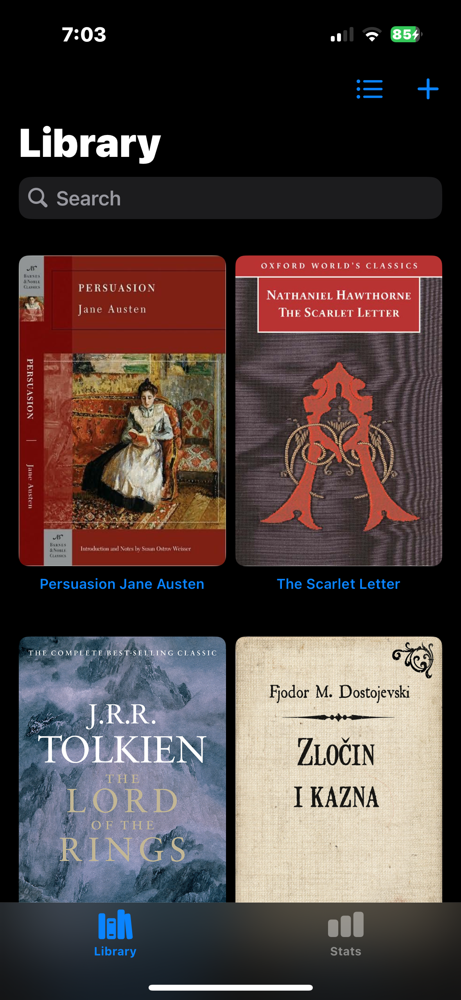
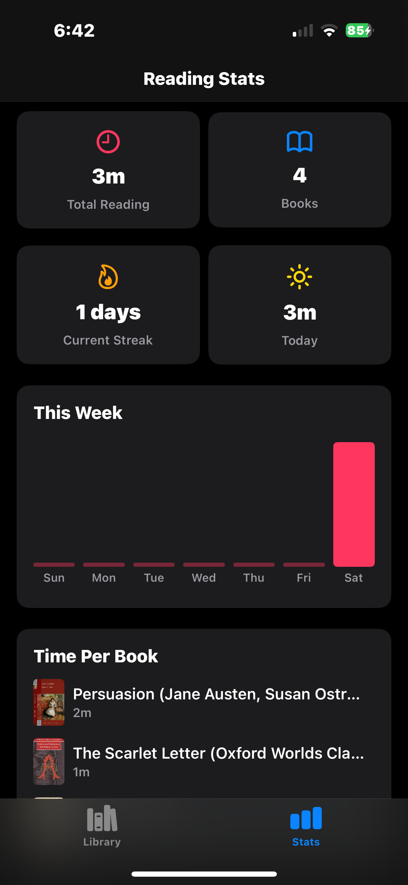
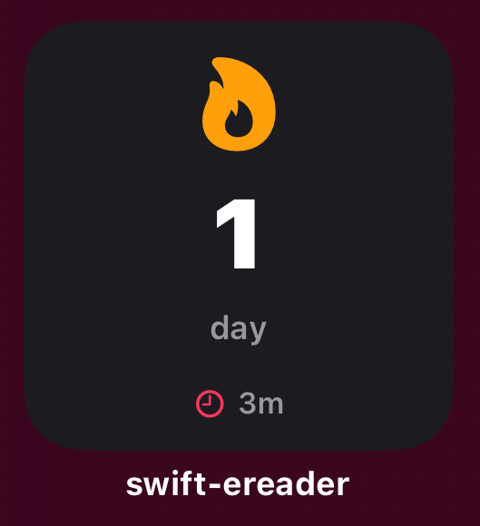
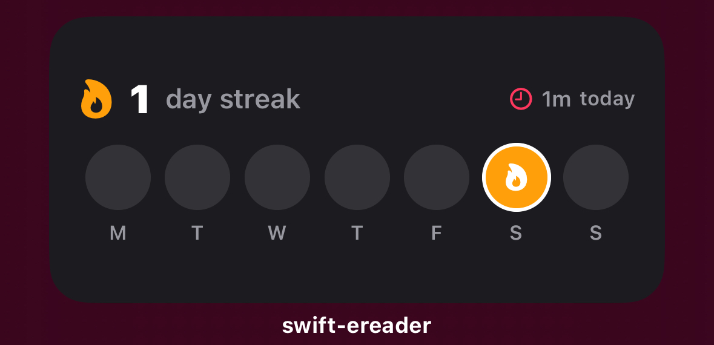
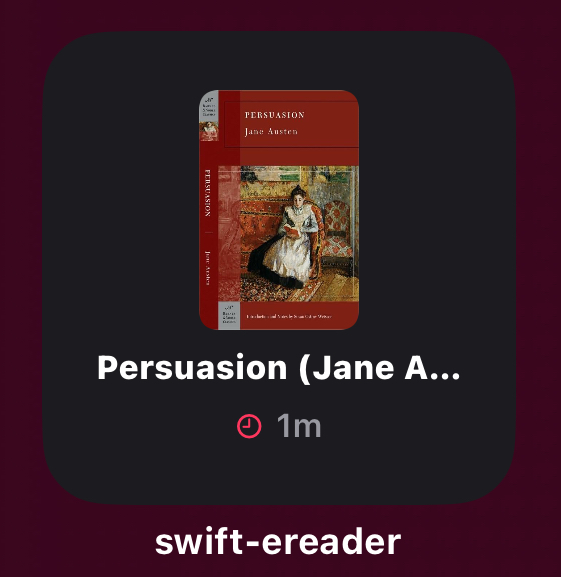

# swift-ereader

an ereader that can finally read books

just a learning project i built for fun while learning swift

## what it does

- reads epub and pdf files (groundbreaking, i know)
- reading progress tracking
- bookmarks, table of contents, themes (light/dark/sepia), adjustable font sizes
- reading stats with streaks and weekly activity
- home screen widgets
- grid and list views in the library

## requirements

- xcode 16+
- ios 18.0+
- swift 5

## tech stuff

- swiftui + swiftdata
- [readium](https://github.com/readium/swift-toolkit) for epub rendering
- pdfkit for pdfs (shocking)
- widgetkit for the widgets

## how to run it

1. clone the repo
2. open `swift-ereader.xcodeproj` in xcode
3. let xcode resolve the readium package dependency
4. build and run
5. import some books and pretend you'll read all of them

## importing books

tap the + button in the library view, pick your epub or pdf files, and they get copied into the app. supports importing multiple books at once for when you're feeling ambitious

## project structure

```
swift-ereader/
  App/              - app entry point
  Models/           - Book, Bookmark, ReadingSession
  Views/
    Library/        - library grid, book cards, import
    Reader/         - epub reader, pdf reader, bookmarks, toc
    Stats/          - reading statistics dashboard
  Services/         - book opener, cover extraction
swift-ereader-widget/  - home screen widgets
```

## screenshots

<details>
<summary>views</summary>

<p align="center">
  
  
</p>
</details>

<details>
<summary>widgets</summary>

<p align="center">
  
  
</p>
<p align="center">
  
  
</p>
</details>
